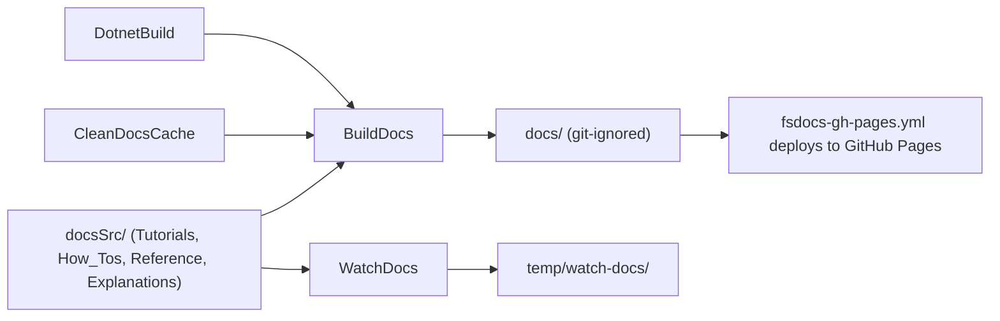

# Documentation site

`fsdocs` generates the MiniScaffold documentation site from `docsSrc/`.
The `BuildDocs` target writes to `docs/`, and `WatchDocs` writes to `temp/watch-docs/` and starts a local server.
`build/FsDocs.fs` wraps `dotnet fsdocs build` and `dotnet fsdocs watch`.


```mermaid
flowchart LR
    Src["docsSrc/ (Tutorials, How_Tos, Reference, Explanations)"] --> BuildDocs
    CleanDocsCache --> BuildDocs
    DotnetBuild --> BuildDocs
    BuildDocs --> Docs["docs/ (git-ignored)"]
    Docs --> Pages["fsdocs-gh-pages.yml deploys to GitHub Pages"]
    Src --> WatchDocs --> Watch["temp/watch-docs/"]
```

Commands (`docsSrc/How_Tos/build-and-preview-docs.md`):

```bash
./build.sh BuildDocs
./build.sh WatchDocs
```

## Structure

`docsSrc/` follows the Divio system (`docsSrc/Explanations/Documentation_System.md`):

| Directory | Reader need |
| --- | --- |
| `Tutorials/` | Learn through a complete example |
| `How_Tos/` | Complete a specific task |
| `Reference/` | Find exact options, commands, or file descriptions |
| `Explanations/` | Understand a design and its reasons |

Each directory has a `0-toc.md` with links to its pages. Page front matter sets `category`, `categoryindex`, and `index`.
The guides and references use Simplified Technical English: short sentences, active voice, and one instruction in each step.

## Build parameters

`build.fs` passes `fsdocs-collection-name`, `fsdocs-repository-branch`, `fsdocs-repository-link`, `fsdocs-package-version`, and links to `README.md`, `CHANGELOG.md`, and `LICENSE.md`.
The site URL is `https://www.jimmybyrd.me/MiniScaffold/` (`documentationRootUrl` in `build.fs`).

## Page template

`docsSrc/_template.html` and `Content/Library/docsSrc/_template.html` keep the Bootstrap layout of fsdocs 18 and follow the fsdocs-tool 22 script contracts:

```html
<html lang="en" data-bs-theme="auto" data-root="{{root}}">
<script src="https://code.iconify.design/iconify-icon/1.0.7/iconify-icon.min.js"></script>
<body>
<dialog id="fsdocs-search" aria-label="Search documentation"><input type="search" /> <div class="results"><ul></ul><p class="empty"></p></div></dialog>
<button id="search-btn" ...>Search</button>
{{fsdocs-content}}
<script>document.documentElement.setAttribute("data-root", new URL(..., location.href).href.replace(/\/$/, ""));</script>
<script type="module" src="{{root}}content/fsdocs-search.js"></script>
```

- `fsdocs-search.js` is an ES module. It reads `data-root`, loads `${root}/index.json`, opens the first `<dialog>` of the page from `#search-btn`, `/`, or `Ctrl+K`, and hides `#search-btn` when `index.json` does not load. The search dialog is the first element of `<body>`, so a `<dialog>` in page content cannot take its place.
- The script imports Fuse.js from `esm.sh`. If a network blocks that host, the module stops before it adds its handlers, and the Search button does nothing. The fsdocs 22 default template has the same dependency.
- `data-root` takes `{{root}}`. An inline script before the module resolves it against the page URL and removes the trailing slash, because the module requests `${root}/index.json`. Without it, the root `https://<owner>.github.io/<repo>/` gives `//index.json`, and `fsdocs watch --root /` gives a request to the host `index.json`.
- Each search result has an `iconify-icon` element, so the templates load the Iconify component, as the fsdocs 22 default template does.
- `fsdocs-tips.js` opens each API tooltip with the popover API. `fsdocs-main.css` hides `div.fsdocs-tip`, so `fsdocs-custom.css` shows `div.fsdocs-tip:popover-open` with `position: fixed`, because the script sets `left` and `top` from viewport coordinates.
- fsdocs 20 removed `FsDocsNavbarPosition`, so the templates link `content/navbar-fixed-left.css` directly.
- fsdocs 20 removed `<FsDocsCollectionNameLink>`. The generated library `build.fs` passes `fsdocs-collection-name-link` (the GitHub repository URL) as a parameter. The root template does not use the key.
- API reference pages use `Content/Library/docsSrc/reference/_template.html`. fsdocs takes `<input>/reference/_template.html` for API pages before `<input>/_template.html` (`BuildCommand.fs` in FSharp.Formatting). That template is `_template.html` without the "Edit this page" element, because fsdocs sets `{{fsdocs-source-filename}}` only for pages that come from a `docsSrc` file. With one template, the API pages kept the literal `{{fsdocs-source-filename}}` in their edit link.
- A change to `Content/Library/docsSrc/_template.html` needs the same change in `reference/_template.html`. ``API page template is the page template without the edit link`` fails when the two differ in more than the edit-link element. The check runs only in the MiniScaffold integration tests, so a generated repository that edits one template does not get it.
- fsdocs also applies `reference/_template.html` to content pages in `docsSrc/reference/`. A guide placed there has no edit link. Put guides in the other `docsSrc` folders.
- The root site builds with `NoApiDocs`, so it has no API pages and no reference template.
- The `MyCoolLib` generated build case checks the generated site with ``docs have no unresolved substitutions`` (no `{{key}}` without spaces or braces inside, and no `{{fsdocs-` text, in any HTML page, and at least one `reference/<project>` API page), ``API page template is the page template without the edit link`` (also: `docs/index.html` links to `edit/<branch>/docsSrc/index.md`, and `docs/reference/index.html` has no edit link), and ``docs use the fsdocs search contract`` (`Asserts.fs`).
- The ReleasePolicy test "root and library docs templates share the fsdocs script markup" requires the same search, dialog, and Iconify lines in both templates, the dialog before `{{fsdocs-content}}`, and identical `fsdocs-custom.css` files.

## Invariants

- `.gitignore` ignores `docs/`, `temp/`, `tmp/`, and `.fsdocs`. Do not put tracked files in a directory named `docs`.
- The build project targets net10.0, so the docs build needs the .NET 10 runtime in addition to SDK 11 (`build-and-preview-docs.md`).

## Related

- [fake-targets.md](fake-targets.md)
- [../ci/workflows.md](../ci/workflows.md)
- [../template/library-output.md](../template/library-output.md) - the generated library has its own docs build.
